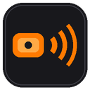
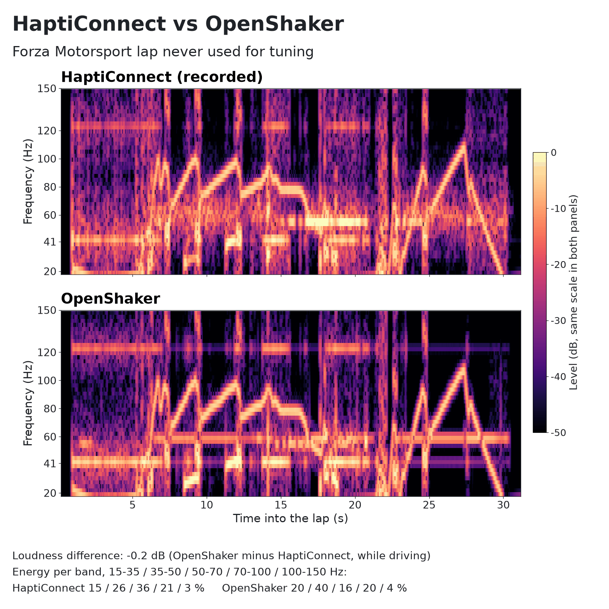
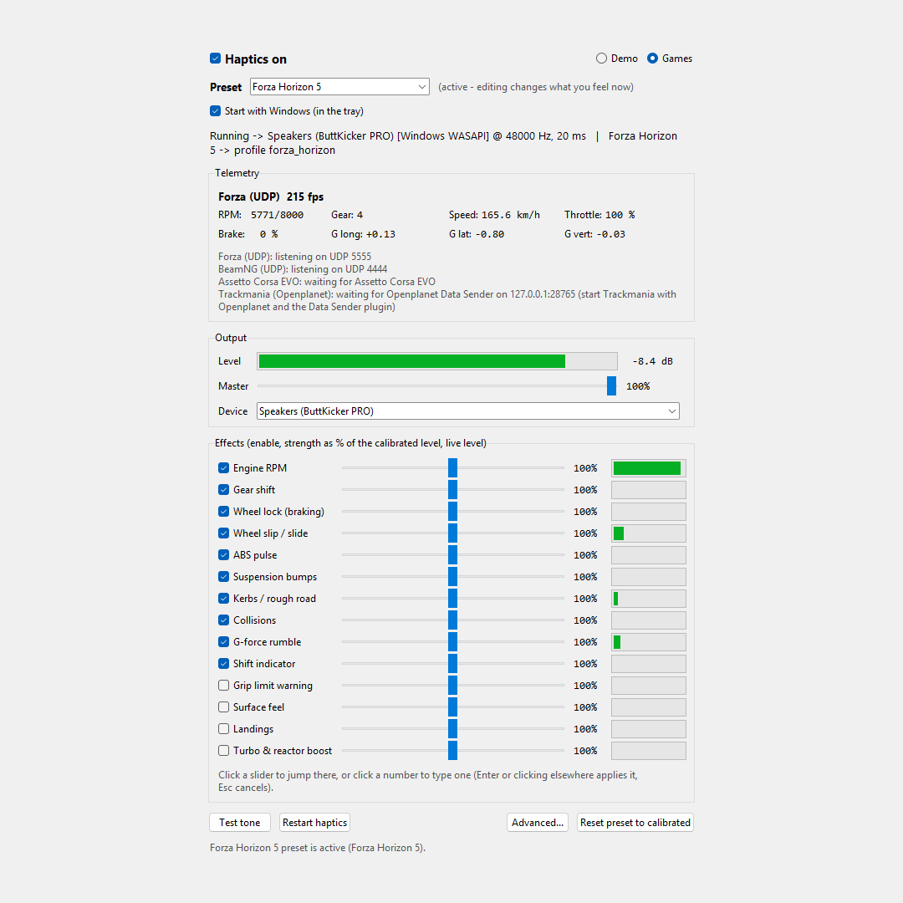
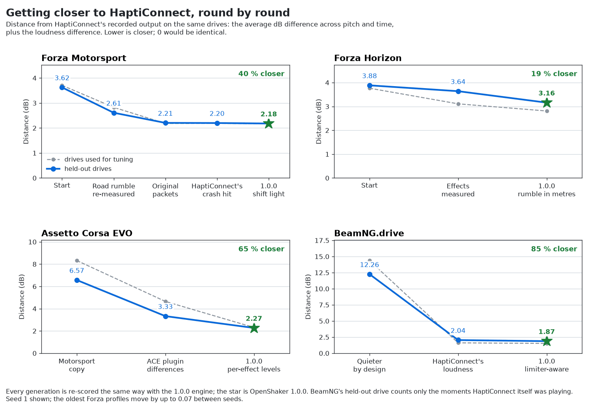

<p align="center">
  
</p>

<h1 align="center">OpenShaker</h1>

<p align="center">
  <b>Game haptics for ButtKicker and other bass shakers.</b><br>
  <i>by baddo &amp; Claude</i>
</p>

<p align="center">
  <a href="https://github.com/baddo-baddo/OpenShaker/releases/latest"></a>
  <a href="https://github.com/baddo-baddo/OpenShaker/releases"></a>
  <a href="LICENSE"></a>
  
</p>

<p align="center">
  <a href="docs/HOW_IT_WAS_TUNED.md"></a>
  
</p>
<p align="center">
  <sub>Left: HaptiConnect and OpenShaker on a Forza Motorsport lap never used for tuning, 0.2 dB apart
  (<a href="docs/HOW_IT_WAS_TUNED.md">how it was tuned</a>). Right: the OpenShaker window.</sub>
</p>

OpenShaker is a small Windows app that reads what your racing game reports - engine revs, gear
changes, bumps, crashes, wheel lock and slip - and turns it into vibration you feel through your seat.
It plays the effects to your shaker like sound. Forza, Assetto Corsa EVO and BeamNG.drive need nothing
extra, just their own telemetry setting; Trackmania needs Openplanet (free,
[openplanet.dev](https://openplanet.dev)) with its Data Sender plugin.

## Download and install

1. Download **OpenShaker-Setup-&lt;version&gt;.exe** from the [latest release](../../releases/latest).
   If your browser says the file isn't commonly downloaded, choose **Keep** (in Edge: **...** >
   **Keep** > **Show more** > **Keep anyway**).
2. Double-click it. The installer is not code-signed, so Windows may show **"Windows protected your
   PC"**: click **More info**, then **Run anyway**.
3. Click **Next**. That is the only screen, and it installs straight away: it needs no administrator
   rights, and **Start with Windows** and a desktop shortcut are both ticked - untick either if you prefer.

OpenShaker starts by itself when setup finishes and opens its window. Closing the window keeps it
running in the notification area, next to the clock. If you don't see its icon, click the **^** arrow
next to the clock; opening OpenShaker from the Start menu again also brings the window back.

### First run

1. **Turn your shaker's amplifier down.**
2. In the OpenShaker window, choose your shaker **by name** under **Output > Device**, not "(Windows
   default output)": if the shaker is unplugged, Windows makes your speakers the default output.
3. Press **Test tone** (a 5-second rumble). It is about as strong as the hardest hits and ignores the
   Master slider, so set the amplifier firm but never clattering. Normal driving in the Forza games is
   quieter; BeamNG.drive plays close to this level most of the time. Nothing? Try **Advanced... >
   Output channel**: Right or Both.
4. Turn on telemetry in your game (below) and drive. OpenShaker switches to that game's preset by
   itself.

### Game setup

| Game | In the game | Notes |
|---|---|---|
| Forza Horizon 5 / 6 | Settings > HUD and Gameplay > **Data Out: On**, IP `127.0.0.1`, port `5555` | |
| Forza Motorsport | Same setting, format **Car Dash** | Not Sled: it has no gear or pedal data, so gear shifts never play |
| Assetto Corsa EVO | Nothing to set | |
| BeamNG.drive | Options > Other: tick **OutGauge** and **Motion Sim**, and leave both on `127.0.0.1` port `4444` | OutGauge gives engine, gears and pedals; Motion Sim gives crashes, bumps and wheel lock |
| Trackmania | 0. Install Openplanet from [openplanet.dev](https://openplanet.dev) (most Trackmania players already have it). 1. In the game press F3, then Openplanet > Plugin Manager, and install **Data Sender** (by ar). That's all: OpenShaker starts Data Sender's service and changes its broadcast interval from the default 100 ms to 0 (every frame), so it sends often enough to feel bumps and crashes. It changes nothing else, and leaves an interval you chose yourself alone | **Needs Openplanet** (free, 1.26 or newer) and Data Sender 2.0, allowed where you drive. If you raise Data Sender's vehicle state rate, set its TCP max telemetry msgs/s to 0 as well, or the data stops for a moment every second |

**Forza on an Xbox or another PC:** point Data Out at this PC's network address, set
**Advanced... > Forza listen address** to `0.0.0.0`, and allow OpenShaker through Windows Firewall
when asked. Otherwise OpenShaker only listens to games on this PC.

## Built with AI, open to feedback

OpenShaker was designed, measured and coded with **Claude**, Anthropic's AI assistant, under the
maintainer's direction and testing on a real rig. It has been checked against HaptiConnect's own
output on recorded laps and real drives ([how it was tuned](docs/HOW_IT_WAS_TUNED.md)), but it is a young
project, and your setup is not the one it was tuned on.

[](docs/HOW_IT_WAS_TUNED.md)

Reports are very welcome - bugs, and just as much "how it feels on my setup":
**[open an issue](https://github.com/baddo-baddo/OpenShaker/issues/new/choose)**, or pick **Send
feedback / report a bug** in the tray menu. Nothing is sent automatically. If you attach the log from
`%APPDATA%\OpenShaker\logs`, read it first: file paths in it can contain your Windows user name.

**Privacy:** OpenShaker's only contact with the internet is the daily update check, one request to
GitHub that carries nothing but the app's name and version; it can be switched off under **Advanced...**.
Game data never leaves your PC.

## Documentation

The **[OpenShaker guide](docs/wiki/README.md)** explains every feature in short, single-topic pages,
grouped in seven chapters:

1. **[Getting started](docs/wiki/Installing-OpenShaker.md)** - installing, setting up your games, and
   checking that it works.
2. **[Games](docs/wiki/Forza-Motorsport.md)** - one page per game: Forza Motorsport, Forza Horizon 5 and 6,
   Assetto Corsa EVO, BeamNG.drive and Trackmania.
3. **[Effects](docs/wiki/Effects-Overview.md)** - all 14 effects, what you feel, and which game supports
   which.
4. **[Using OpenShaker](docs/wiki/The-Main-Window.md)** - the window, the tray menu, presets, Advanced
   settings, Start with Windows and updates.
5. **[Your hardware](docs/wiki/Shakers-Amplifiers-and-Channels.md)** - shakers, amplifiers, channels and
   safety.
6. **[Help](docs/wiki/Troubleshooting.md)** - troubleshooting, FAQ and glossary.
7. **[Behind the scenes](docs/HOW_IT_WAS_BUILT.md)** - how it was built, and
   [how it was tuned](docs/HOW_IT_WAS_TUNED.md) against HaptiConnect.

What changed in each version: the [changelog](docs/CHANGELOG.md).

For developers: [development notes](docs/DEVELOPMENT.md), [calibration tools](docs/CALIBRATION.md) and
[contributing](.github/CONTRIBUTING.md).

## Using OpenShaker

- **Left-click** the tray icon to open the window; **right-click** it for status, Haptics on, Test
  tone, Start with Windows, the settings folder, Send feedback and Quit. Closing the window keeps
  OpenShaker running; **Quit** stops it.
- **Haptics on** (top of the window, and in the tray menu) switches the haptics off and on. Off stops
  everything: nothing plays, the game ports are free for other programs, and the tray icon turns grey.
  It stays off, even after a restart, until you tick it again or press **Restart haptics**.
- Each game has its own **preset**. Every effect has an on/off box and a **strength** slider, where
  100 % is the calibrated level. Changes save themselves.
- Click anywhere on a slider to jump there, or click the number next to it and type a value: Enter
  or clicking elsewhere applies it, Esc cancels. Master works the same way, in percent.
- **Surface feel**, **Landings** and **Turbo & reactor boost** only work in Trackmania, the only game
  that reports surfaces, jumps and boosts. The **Grip limit warning** is on for Trackmania: it pulses as
  a corner builds toward a slide on dirt, grass, sand, snow, ice and wet roads. On tarmac the Stadium
  car turns as tight as its steering allows without letting go, so the warning stays quiet there. It
  can be switched on for the other games too.
- **Master** sets the overall level and is remembered. The shipped levels were tuned on a ButtKicker
  PRO; on other hardware use your amplifier and Master to taste. Each game plays at HaptiConnect's own
  level for it, so BeamNG.drive, like HaptiConnect's BeamNG preset, is much stronger than the Forza
  games: set the amplifier with the strongest game you play.
- **Demo** plays a scripted drive - gear changes, a kerb, a lock-up, wheelspin, a bump, a crash and
  ABS - quieter than a game, to check the setup without one. What you feel of it depends on the active
  game's preset: every preset plays the engine, gear changes and the crash, but not every preset has
  every other effect (BeamNG.drive's, like HaptiConnect's, has no kerb or ABS effect). Pick **Games**
  again to go back to your game.
- **Output channel** (Advanced): **Left** is the default and plays on the left channel only, like
  HaptiConnect; the right channel stays silent. For a shaker on one side of an amplifier pick that
  side; for two shakers pick **Both**. On a shaker that mixes both channels, such as a ButtKicker PRO, Both may feel stronger.
- **Updates:** once a day OpenShaker asks GitHub whether a newer version exists. If one does, the tray
  icon gets a small **!** and the window a bar with **Update now**, **What's new** and **Skip this
  version** - no pop-ups. **Update now** downloads the installer from this project's GitHub release,
  checks it against its published SHA-256, installs it and starts OpenShaker again; nothing is
  downloaded before you click it. Switch the check off under **Advanced... > Check for updates**.
- To uninstall: Windows Settings > Apps > Installed apps > OpenShaker. It asks whether to delete your
  settings too.

## Safety

- **Start low** and raise the level slowly. Shakers and amplifiers are powerful.
- **Back off if it clatters, buzzes or distorts** - that can damage the shaker, the amplifier or the
  seat mount.
- **Think of the neighbours.** Low frequencies travel through floors and walls.
- **Pick the shaker by name** under **Output > Device**. Then OpenShaker never switches outputs on its
  own: if the shaker is unplugged it says so instead of playing through your speakers, and picks it up
  again when it is plugged back in. Left on "(Windows default output)", it plays wherever Windows
  sends sound, which after an unplug can be your speakers.

## Tested hardware and software

Tested during development in September 2026.

- **Shaker:** ButtKicker PRO (USB-C). Windows sees it as a USB audio device (VID `33A1`, PID `52DA`)
  with the output "Speakers (ButtKicker PRO)" - or "Speakers (2- ButtKicker PRO)" after re-plugging -
  used in shared mode at 48 kHz.
- **PC:** Windows 11 Pro for Workstations 25H2 (build 26200.9445).
- **Calibration reference:** HaptiConnect 2.7.0.

| Game | Version | How it was tested |
|---|---|---|
| Forza Motorsport | Microsoft Store 1.859.7102.0 | **Live:** eight laps compared with HaptiConnect's output on the same laps, all within 0.4 dB, including two laps left out of the fitting (-0.4 and -0.2 dB) |
| Forza Horizon 5 / 6 | Steam, September 2026 | **Live:** three Forza Horizon 5 laps and one Forza Horizon 6 lap compared with HaptiConnect; every effect that plays on these laps was measured against it (braking could not be isolated, and the game never reported ABS). Laps play 0 to 1.3 dB quieter until the acceleration and road-rumble sounds are reproduced exactly |
| Assetto Corsa EVO | Steam Early Access, September 2026 | **Live and felt:** two drives compared with HaptiConnect's own ACE plugin through a replay (+0.4 and -0.5 dB, scored at one copy's level; the recordings likely hold HaptiConnect's output twice); current ACE builds no longer reach HaptiConnect live |
| BeamNG.drive | 0.39.4.0 | **Live:** two drives compared with HaptiConnect, one over OutGauge only and one over OutGauge and Motion Sim: within 0.6 dB (+0.1 and +0.6 dB). Crash, bump and wheel-lock strengths are not yet checked against HaptiConnect |
| Trackmania | Steam, Openplanet 1.28.0 + Data Sender 2.0.0 | **Live and felt:** two drives felt and one logged (Stadium car); jumps, slides and the grip warning were reworked from them. The loose-surface grip limits are still first guesses |

## Should also work (untested)

OpenShaker isn't tied to one device: to Windows, a bass shaker is just a sound output, so any shaker
your PC can play sound to should work. Only the ButtKicker PRO has been tested so far.

- Other ButtKicker models through their amplifiers: Gamer Plus, Gamer PRO, LFE, Advance.
- Other bass shakers on any amplifier, such as the Dayton Audio BST-1 or TT25 and the AuraSound AST-2B-4.
- Any Windows audio output that feeds a shaker amplifier: line or headphone out, USB, optical or HDMI.
- Windows 10.
- Assetto Corsa and Assetto Corsa Competizione (basic effects, using the Assetto Corsa EVO preset).
- Forza Horizon 4 (sends the same data as Forza Horizon 5).

On a different shaker or amplifier:

- Pick your shaker **by name** under **Output > Device**, not the Windows default, so an unplugged
  shaker never sends the effects to your speakers.
- OpenShaker plays on the **left channel** only, like HaptiConnect. For a shaker on the right side of
  an amplifier, pick **Right** under **Advanced... > Output channel**. For two shakers on one stereo
  amplifier, pick **Both**: they get the same signal.
- The levels were calibrated on a ButtKicker PRO, so **start with the amplifier turned down**. Press
  **Test tone** (about as strong as the hardest hits in a game) and turn up until it feels firm but
  never clatters. Normal driving is quieter than that.
- OpenShaker shares the output with other apps; it never locks them out.

More in [Shakers, amplifiers and channels](docs/wiki/Shakers-Amplifiers-and-Channels.md). If you try
it on another shaker or amplifier, please
**[tell us how it feels](https://github.com/baddo-baddo/OpenShaker/issues/new/choose)**: those reports
are how the tested list grows.

## What about SimHub?

[SimHub](https://www.simhubdash.com/) can drive bass shakers too, with its ShakeIt module, for the
other games here, and it does much more: dashboards, motion rigs, wind and LEDs. OpenShaker is a small
program that does one thing: it feels like HaptiConnect straight away, with presets tuned against
HaptiConnect's own output, so there is nothing to set up. It also supports Trackmania (2020), which
[SimHub's list of supported games](https://www.simhubdash.com/supported-games/) doesn't include (it
lists Trackmania 2 and Trackmania Turbo; checked in September 2026). If SimHub already works for you,
keep using it.

## Troubleshooting

**"Windows protected your PC" when running the installer.** The installer is not code-signed. Click
**More info**, then **Run anyway**.

**"output device '...' is not connected".** Choose your shaker under **Output > Device**. A USB
shaker can take a moment to appear after Windows starts; OpenShaker keeps checking every 15 seconds.

**"... stopped playing - unplugged or switched off?"** The shaker went away while OpenShaker was
using it. Plug it back in or switch it on and OpenShaker picks it up again by itself - every few
seconds for the first minute, then every 15 seconds. **Restart haptics** (window or tray menu) tries
at once.

**Nothing plays and the tray icon is grey.** Check that **Haptics on** is ticked (window or tray
menu). While it is off, the window says "Haptics off".

**It runs, but the shaker is quiet.** Try Test tone, the output channel, the Windows volume for that
output, and check the amplifier is on. **Restart haptics** starts the audio afresh.

**"cannot bind UDP 5555" (or 4444).** Another program - HaptiConnect or SimHub, for example - is
using that port. Close it, or move the game's telemetry to another port and enter it under
**Advanced...**.

**No game detected.** Check the game's setting in the table above. The window shows each game's
status; BeamNG says which box is not ticked, and Trackmania says it is waiting for Data Sender until
the game runs with Openplanet and the plugin.

**Trackmania: "Data Sender is full".** Another program is using all of the plugin's connections. In
Openplanet > Settings > Data Sender > TCP Server, raise **TCP max clients** (8 is the default).

**Trackmania: "refuses control commands".** Data Sender's external control is off, so OpenShaker
cannot start it. Either tick **Allow external control commands** on its TCP Server tab, or press
**Start** on its General tab and tick **Start service on plugin load**.

**The window does not open.** Open `%APPDATA%\OpenShaker\logs` (paste it into the File Explorer
address bar) and look at `gui_error.log`. To start over with default settings, quit OpenShaker and
delete `%APPDATA%\OpenShaker\config.json`.

## How it was built

What the app does, in plain words:

- **It listens to the games.** Forza, BeamNG.drive and Trackmania (through the Openplanet plugin) can
  send live data (speed, rpm, gear, g-forces, wheel slip, suspension) to another program on the PC; Assetto Corsa EVO shares it
  in memory. OpenShaker reads each game's own format and turns it into one common set of numbers.
- **It turns numbers into low-frequency sound.** Each effect - engine, gear shift, bumps, kerbs,
  crashes, acceleration, wheel lock and slip, ABS, shift light - is a small synthesizer driven by
  those numbers. Their sum is played to the shaker, which is simply an audio device to Windows.
- **It was tuned against HaptiConnect.** HaptiConnect, the ButtKicker's own software, has not been
  updated since version 2.7.0 (June 2025): it has no Forza Horizon 6 plugin, its Assetto Corsa EVO
  plugin stopped receiving data when the game renamed its telemetry, and in the maintainer's
  experience its timing was unreliable - on Forza Horizon 5 the delay was sometimes random, and on
  Forza Motorsport it drifted over a session ([details](docs/HOW_IT_WAS_TUNED.md)). Its feel was still
  the reference, so its output on real laps was recorded, the same laps were replayed through
  OpenShaker, and the effect levels were fitted until both matched. The short hits - gear shifts,
  crashes, bumps - and the kerb buzz are generated from a few measured numbers, so no recorded audio
  is included. Over eight Forza Motorsport laps the overall level is within 0.4 dB of
  HaptiConnect, including two laps left out of the fitting (-0.4 and -0.2 dB). Assetto Corsa EVO is
  within 0.5 dB of HaptiConnect's own ACE plugin (scored at one copy's level; the recordings likely
  hold HaptiConnect's output twice), and BeamNG.drive within 0.6 dB on two drives, as strong as
  HaptiConnect's BeamNG preset. On Forza Horizon every effect that plays on these laps was measured
  against HaptiConnect (braking could not be isolated, and the game never reported ABS), but laps
  play 0 to 1.3 dB quieter until its acceleration and road-rumble sounds are reproduced exactly. How it was tuned: [docs/HOW_IT_WAS_TUNED.md](docs/HOW_IT_WAS_TUNED.md).

## For developers

Run from source (Python 3.10 or newer; tested with 3.13):

```powershell
py -3 -m venv .venv
```

```powershell
.venv\Scripts\python -m pip install -r requirements.txt
```

```powershell
.venv\Scripts\python openshaker\app.pyw
```

`.venv\Scripts\python -m openshaker --help` lists the command line (`--list-devices`, `--demo`, `-v`,
...). A source copy uses the same settings folder and Start with Windows entry as an installed copy,
and adds an "OpenShaker" Start menu entry on its first start unless one exists already.
If you turn on Start with Windows from a source copy and a console window opens at login, the venv's
`pythonw.exe` is a launcher stub; `.venv\Scripts\python -m openshaker.autostart repair` fixes it.
`OpenShaker.exe --quit` (from source: `.venv\Scripts\python -m openshaker.gui --quit`) closes a
running copy, for example before a script that needs the game's telemetry ports.

Tests:

```powershell
.venv\Scripts\python -m unittest discover -s tests
```

Build the installer: install 64-bit [Python 3.13](https://www.python.org/downloads/) (the version the
pinned packages were made with; the build refuses any other) and
[Inno Setup 6](https://jrsoftware.org/isdl.php), then run `installer\build.bat`. It makes a clean build
environment with the pinned versions in `installer/constraints.txt`, regenerates
`installer/THIRD-PARTY-NOTICES.txt`, bundles the app with PyInstaller (`installer/OpenShaker.spec`) and compiles
`installer/OpenShaker.iss` into `dist\OpenShaker-Setup-<version>.exe`.

More: [docs/DEVELOPMENT.md](docs/DEVELOPMENT.md) (how the code fits together) and
[docs/CALIBRATION.md](docs/CALIBRATION.md) (recording, fitting and tuning tools; they need
`docs/requirements-dev.txt`).

## Disclaimer and license

OpenShaker is an independent project. It is **not affiliated with, endorsed by or supported by The
Guitammer Company (ButtKicker, HaptiConnect), Microsoft (Forza, Xbox, Windows), Kunos Simulazioni
(Assetto Corsa), BeamNG GmbH (BeamNG.drive), Nadeo or Ubisoft (Trackmania), Valve (Steam), Openplanet,
the author of the Openplanet Data Sender plugin, SimHub, Anthropic, or any other game, software,
shaker or amplifier maker named here**; all product names are trademarks of their owners. Claude, an
AI model made by Anthropic, is credited as co-author for the work it did; Anthropic does not publish
or support OpenShaker.

Released under the MIT License - see [LICENSE](LICENSE). The installed program also contains
open-source components under their own licences, listed with their full texts in
[THIRD-PARTY-NOTICES.txt](installer/THIRD-PARTY-NOTICES.txt).
