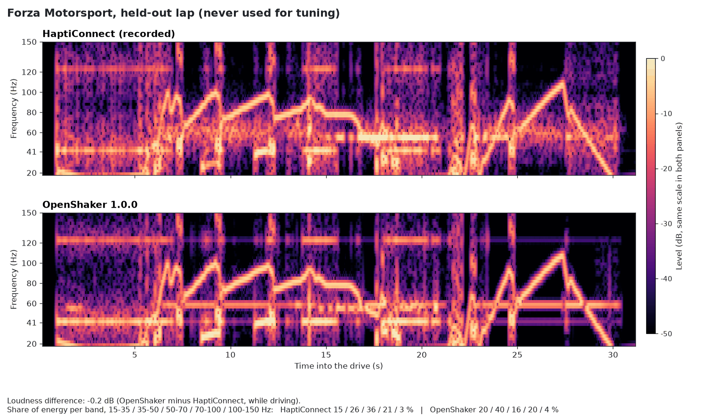
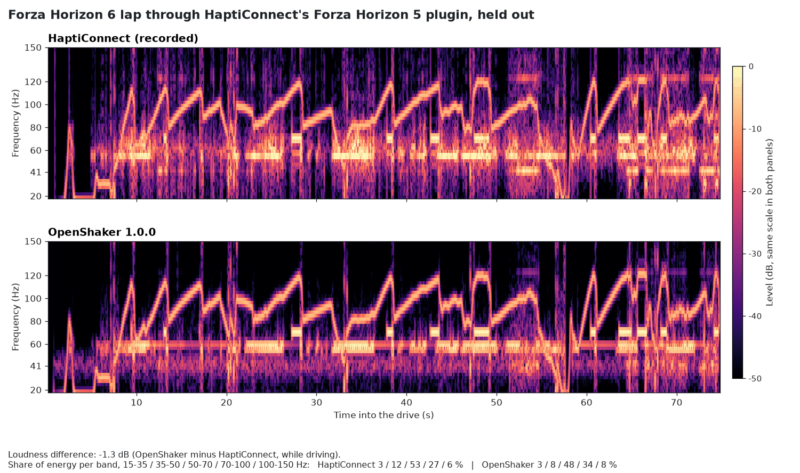
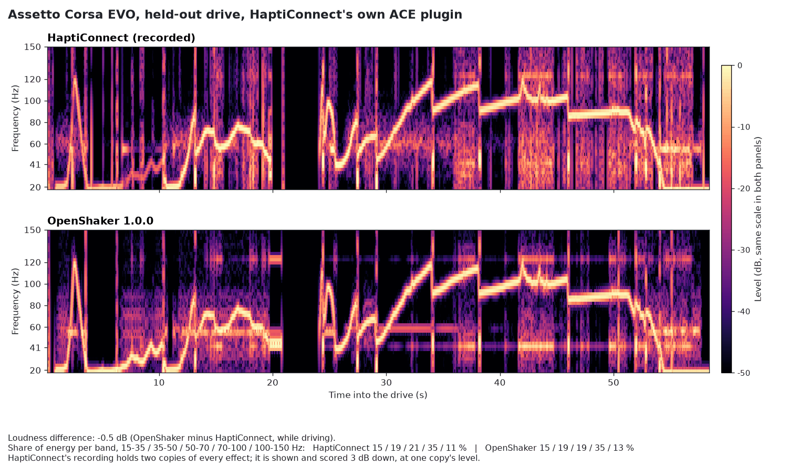
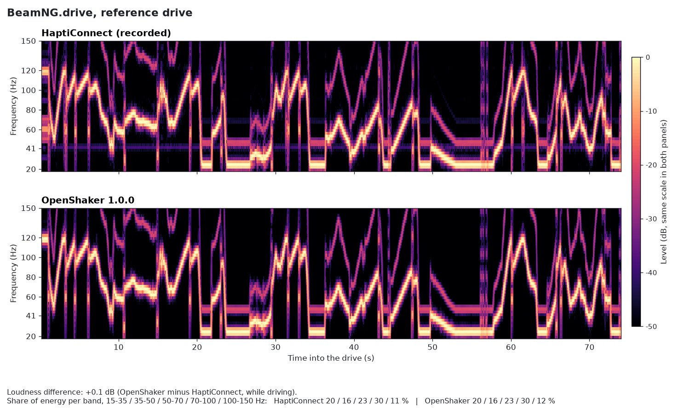

# How OpenShaker learned to feel like HaptiConnect

*A detective story told in spectrograms.*

**On average, every round of tuning brought OpenShaker closer to HaptiConnect on the drives held out of the fitting.**

## The problem

HaptiConnect is the ButtKicker's own software. It turns racing-game telemetry into vibration you feel through your
seat, and when it works it feels good. But it has not kept up:

- **It is no longer maintained.** Version 2.7.0, from June 2025, is still its latest release at the time of writing.
- **It doesn't support Forza Horizon 6.** There is no Horizon 6 plugin, and its Forza plugins only start listening
  while their own game is running, so Horizon 6 can't simply borrow the Horizon 5 plugin. (We could only measure
  Horizon 6 by replaying its telemetry into the Horizon 5 plugin, with Horizon 5 sitting at its menu.)
- **Its Assetto Corsa EVO support stopped working.** HaptiConnect looks for the game's data under the old
  shared-memory names (`acpmf_*`), but since Early Access v0.6 the game publishes it as `acevo_pmf_*`, with a
  different layout, so HaptiConnect receives nothing.
- **Choosing the shaker as its output device was flaky**, in the maintainer's experience.
- **Its timing wandered.** While driving, the maintainer found HaptiConnect's delay sometimes random on Forza
  Horizon 5, and drifting over a session on Forza Motorsport. Our recordings back the first part. Most gear changes
  reached HaptiConnect's output about 75-92 ms after the game reported them (the median of each recording, measured
  from the replayed telemetry, which itself sends a packet every 17 ms). But within one Horizon 5 replay the delay
  jumped between 73 and 249 ms from one gear change to the next, and on two Motorsport laps single gear changes
  arrived 200-340 ms late. Each replay lasts only a few minutes, so they cannot show a slow drift over a whole
  session: that part is what the maintainer felt on long drives.

OpenShaker renders its output in fixed 10 ms blocks from the newest telemetry it has received, with a constant
1.3 ms look-ahead in its limiter; its end-to-end delay on a live system has not been measured yet.

OpenShaker was built to replace HaptiConnect, with one goal that is easy to say and hard to reach: **feel exactly
like HaptiConnect, loudness included**, so that switching from one to the other changes nothing.

There is no specification for what HaptiConnect plays. So we measured it from the outside, one effect at a time,
until OpenShaker's output matched it.

> **How this was made.** The measuring, the fitting and the code were done with **Claude**, Anthropic's AI
> assistant, under the maintainer's direction and testing on a real ButtKicker PRO rig. That means two things.
> Every result on this page was checked against **recordings of HaptiConnect's actual output**, not against what
> anyone expected it to do. And the tuning comes from one rig and a handful of drives, so your setup may well
> find something we missed. [Tell us](#tell-us-how-it-feels): real-world feel reports are the most useful thing
> you can send.

## Chapter 1: play the same drive through both

You can't compare two programs fairly if each gets a different drive. So every comparison plays **one drive
through both**:

1. **Drive a lap with OpenShaker logging the game's telemetry**: engine speed, gear, g-forces, suspension, wheel
   slip, kerbs and so on. For the Forza games every packet is kept byte for byte. The Assetto Corsa EVO drives were
   recorded before that was possible and are replayed from the logged values.
2. **Replay that exact telemetry into HaptiConnect** (the game sits at its menu, so HaptiConnect is listening), and
   **record what it sends to the shaker.** Windows can capture an output device's signal digitally, so there's no
   microphone and no room noise: it is exactly the audio HaptiConnect produced.
3. **Render OpenShaker's output from the same telemetry**, through the same engine the app uses, and compare.

On most recordings HaptiConnect answers roughly 65-90 ms after the telemetry arrives (not always: see The problem),
so every comparison first finds that delay and
lines the two signals up to within 5 ms.

**Reading the pictures.** The images are **spectrograms**: time runs left to right, pitch goes up (15-150 Hz, the
range a shaker plays), and brightness is strength. The engine is the line that climbs and falls with the revs, gear
changes are short bright marks, and a steady tone is a flat line.

## Chapter 2: the detective work

The first measurements used **probes**: invented telemetry that exercises one effect at a time, such as a slow rev
sweep, isolated gear changes or growing bumps. Probes are quick and clean, but they only show what they manage to
trigger: the shift-light probe never made HaptiConnect play anything, and the rumble-strip probe only once (all four
wheels on the strip at 35 m/s). So the next step
was reading HaptiConnect's output on real laps. That first reading got several things wrong, until each effect was
measured directly, line by line, in the recordings.

**The rumble strip that never hit the ceiling.** The first look at real laps suggested the kerb buzz stops rising at
about 42 Hz, however fast the car goes. Measuring the buzz itself showed there is no ceiling at all: it keeps rising
at 1.25 Hz for every metre per second of speed (76 Hz at 61 m/s). The "ceiling" was a different effect, the 41 Hz
road rumble, which also plays whenever a wheel is on a kerb.

**The shift light that wasn't a ramp.** The first look suggested a tone that fades in as the revs climb. Measured
directly, it is a 70 Hz tone that **switches on** at about 84 % of the maximum revs. It plays even when you lift off
the throttle, and it is almost silent in reverse.

**The random gear change that wasn't random.** Gear-change thumps seemed to come at random pitches between about 24
and 70 Hz. They are not random: the thump is a short square wave at exactly **half the engine's pitch**, and the
"randomness" was just the spread of revs at which the gears changed. (The gear-change calibration runs that set the
first thump held the engine at exactly 4000 rpm, and half of that engine pitch is 33 Hz: that is where the
long-standing "~33 Hz" belief came from.)

**The "Horizon offset" quirk.** HaptiConnect's Forza Motorsport plugin reads the gear and the pedals from the
positions where *Forza Horizon* keeps them in its data packet. Feed it genuine Motorsport packets and its gear-change,
wheel-lock and shift-light effects never fire. The calibration tools send it the Horizon layout for that reason.

**Only the left channel.** HaptiConnect writes its signal to the **left channel** and leaves the right one
completely silent. Checking this uncovered a bug of our own: OpenShaker's "Left" setting was actually reaching both
channels, which on a shaker that adds them makes it up to twice as strong. It's fixed in 1.0.0, and a recording of
the app's output confirms that the right channel is now exactly silent.

**The slider that isn't linear.** HaptiConnect's strength slider looks like it goes from 0 to 100 %, but half
strength is **at least 15.8 dB** quieter than full strength, far more than half.

**The invisible limiter.** In the clean recordings, HaptiConnect's output stays at or below 0.985 of full scale (the
one brief overshoot, to 0.991, is in a replay that held two copies of HaptiConnect's output).
That isn't clipping: when
something loud arrives, a limiter turns the **whole mix** down, looking about 1.3 ms ahead and letting the volume back up
along a straight ramp (from half volume to full takes about 0.6 s). In BeamNG, where everything plays at full strength, you can see the engine dip under every gear
change. OpenShaker 1.0.0 now ends in the same kind of limiter.

**Each game is its own puzzle.**
- Forza Horizon never reports rumble strips at all, so HaptiConnect plays no kerb buzz there.
- The road rumble follows how fast the suspension moves, measured **in metres** rather than as a percentage of its
  travel (both Forza plugins), and on Horizon it is a textured rumble rather than a clean tone.
- HaptiConnect's BeamNG setup simply has no wheel-slip, shift-light, ABS or kerb effect.
- HaptiConnect no longer receives live data from current Assetto Corsa EVO builds (the game renamed its telemetry),
  so its ACE plugin could only be measured by replay. Even then it most likely rendered every effect **twice** (a
  second HaptiConnect plugin appears to wake up on the replayed data), so those recordings are scored at one copy's
  level.

## Chapter 3: making the numbers converge

Each OpenShaker effect is a small synthesizer driven by a few numbers: a pitch law, a strength curve, some
thresholds and a volume. Tuning means finding the numbers that reproduce HaptiConnect. It happened in rounds:

1. **A first guess for every effect at once.** Each effect is rendered on its own from the drive, and HaptiConnect's
   recording is explained as a mix of them: a non-negative least-squares fit on their power spectrograms, which
   gives a starting volume for each effect.
2. **An optimizer with a held-out lap.** The volumes are then refined to minimise one score, the **distance**: the
   average difference in decibels between the two spectrograms, in 10 Hz bands and 50 ms steps, plus the overall
   loudness difference. Some drives are used for tuning and at least one is **held out**. It never influences the
   fit; it only shows whether the result carries over to a drive the tuning has not seen.
3. **Gates before anything ships.** A change normally had to pass, on two different random seeds: the tuning
   drives improved clearly, none of them got worse, the held-out drives did not get worse, no drive's loudness
   drifted, the targeted pitch band moved toward HaptiConnect, no volume ended at the optimizer's limit, the test
   suite passed, and the built-in Demo stayed well below full scale. A few changes went in with a gate missed, each
   one logged with its reason and approved by the maintainer. The second Forza Motorsport refit (on the raw-packet replays) missed
   two gates by hairlines. The Forza Motorsport collision change could not move lap averages that 21 crashes barely touch. And
   Forza Horizon's lap-level gates had only been passing because two of its errors cancelled out. That last case is
   why the final rounds changed method.
4. **Exact-parity rounds.** A good overall score can hide two errors that cancel out, for example one effect too
   loud covering another that is too quiet. So the final rounds measured **every effect at the moments it plays**
   (the engine on steady revs, each gear change, each kerb, the road rumble by suspension speed, acceleration by
   driving situation), always against OpenShaker's **whole** mix in the same pitch band and time window.
   - Each change was fitted on some drives and confirmed on held-out ones.
   - An independent reviewer (a separate Claude agent working with its own scripts) then re-measured it. Several
     changes were rejected at this step,
     for example a rough-road setting that could only be checked on the drive it was tuned on.
   - When HaptiConnect did something OpenShaker could not express (the limiter, left-channel output, road rumble in
     metres, textured rumble, forces that add together, no shift light in reverse), the **app** was changed. Turning
     a volume up or down to hide a difference was never allowed.

## Chapter 4: side by side

Each figure shows HaptiConnect's recorded output on top and OpenShaker 1.0.0 underneath, for the same drive, on
identical axes and the same colour scale. Wherever a usable one exists, the drive was **held out of the final fits**
(for Forza Motorsport it was never used for tuning at all).

### Forza Motorsport

**The engine sweeps and the gear-change thumps line up almost exactly. Our 41 Hz road rumble is still a little
strong on this car (its fix waits for the acceleration sound), and our acceleration tone near 58 Hz is steadier than
HaptiConnect's looser rumble.**

### Forza Horizon

**On a Forza Horizon 6 lap held out of the final fits, the engine, gear changes and shift light (the short 70 Hz
blocks) match. HaptiConnect's acceleration feel spreads over 50-70 Hz where OpenShaker plays a tone; that, and the
extra rumble HaptiConnect adds on rough ground, is most of why this lap plays 1.3 dB quieter.**

### Assetto Corsa EVO

**Measured against HaptiConnect's own ACE plugin, the engine, gear changes and road texture follow closely, and the
loudness is within half a decibel; OpenShaker's acceleration and road-rumble tones (the flat lines near 58 and
41 Hz) are still cleaner than HaptiConnect's.**

### BeamNG.drive

**At HaptiConnect's own loudness, BeamNG's engine tone, which carries about 95 % of what HaptiConnect plays in this
game, is a near-perfect match; the faint steady lines in HaptiConnect's panel are the small differences left.**

## Chapter 5: what's still different

Everything below is measured, and none of it has been hidden with a volume change:

- **The acceleration feel.** HaptiConnect's acceleration effect is a rumble spread over roughly 52-72 Hz;
  OpenShaker's is a single tone. Pure cornering plays about 6 dB too strong on the laps measured most closely (about
  3 dB on Horizon's held-out laps). This is the
  biggest difference left, and it needs a new kind of sound in the app, not a new setting.
- **Forza Motorsport's road rumble.** A new rumble that follows the suspension in metres is fitted and much closer
  on its own (on the 9000-rpm car it goes from about 9.6 dB too strong to within 1 dB). It is not in 1.0.0: the
  old, stronger rumble currently fills the gap that the acceleration tone leaves, so the two changes have to land
  together.
- **Forza Horizon.** Very rough ground plays about 7-10 dB weaker than HaptiConnect, and only one recorded lap has
  such surfaces. HaptiConnect also treats Forza Horizon 5 and 6 noticeably differently (its road rumble differs by
  up to 6-7 dB depending on suspension speed), while OpenShaker plays both with one profile. The crash detector is
  too eager: 11 to 21 of the 40 crashes it found on the four Horizon laps had no matching HaptiConnect hit
  (depending on how strictly a "hit" is counted), all but one on the tuning laps. Wheel slip plays about 4 dB weaker
  than HaptiConnect and wheel lock about 7 dB weaker on the held-out laps, and at walking pace our road rumble is
  still far too strong.
- **Forza Motorsport in reverse.** The shift light is now off in reverse, but HaptiConnect still plays a faint buzz
  there (around 66-74 Hz) that OpenShaker does not: about 10.5-11.7 dB of difference, on little data.
- **BeamNG.** HaptiConnect plays a buzzing rev-limiter sound that OpenShaker 1.0.0 doesn't play: the app has
  opt-in code for it, but it is not fitted or switched on yet. Wheel-lock, crash
  and bump strengths could not be measured, because HaptiConnect's own playback dropped out at every such moment in
  our recordings; they keep their earlier balance until a clean recording exists.
- **Assetto Corsa EVO.** The recordings hold two copies of HaptiConnect's output, so the exact loudness rests on
  scoring them at one copy's level. HaptiConnect also seems to respond to cornering in ACE, which we could not
  measure well enough to copy (OpenShaker plays about 8 dB less there), and the two recordings disagree about deep
  slides by about 15 dB (OpenShaker plays 14 dB over one and 1.4 dB under the other). One clean single-copy recording would settle all three.
- **Not measurable yet on Forza Horizon.** Braking: every braking moment in our laps also holds a downshift, so
  the brake effects cannot be isolated. ABS: the game reports it as never active in our laps. Kerbs: Forza Horizon
  never reports them at all (see Chapter 2), so there is no kerb effect to match.

## The numbers

All numbers come from one scoring run: each game's starting profile and the 1.0.0 profile, both rendered with the 1.0.0 engine on the same drives. The 1.0.0 numbers are identical on random seeds 1 and 2. The oldest Forza profiles still gave the gear change a random pitch, so their numbers move by up to 0.15 on a single lap (0.07 on the held-out averages) between seeds; seed 1 is shown. **Level** is OpenShaker's loudness minus HaptiConnect's while driving, **distance** is the score from Chapter 3 (lower is closer), **corr** is how closely the two loudness envelopes rise and fall together (1 would be identical), and the **bands** are the share of energy in 15-35 / 35-50 / 50-70 / 70-100 / 100-150 Hz. Drives marked *held out* were left out of the final fits. For Forza Motorsport they were left out of every optimizer fit; lap 6 was also used to read HaptiConnect's engine level and shift-light pitch, so only lap 2 was never used at all. A few earlier Horizon, ACE and BeamNG measurements looked at every recording, because there are only a handful.

| Recording | Profile | Level before -> after | Distance before -> after | Corr (after) | HaptiConnect bands | Our bands (after) |
|---|---|---|---|---|---|---|
| Forza Motorsport lap 1 | forza_motorsport | +0.2 -> -0.2 dB | 3.02 -> 1.77 | 0.77 | 7 / 26 / 26 / 31 / 11 | 4 / 31 / 22 / 31 / 11 |
| Forza Motorsport lap 3 | forza_motorsport | -0.8 -> -0.4 dB | 4.12 -> 2.46 | 0.73 | 5 / 19 / 46 / 23 / 7 | 4 / 36 / 29 / 21 / 10 |
| Forza Motorsport lap 4 | forza_motorsport | +0.2 -> +0.0 dB | 3.00 -> 1.77 | 0.82 | 5 / 24 / 28 / 35 / 8 | 3 / 31 / 23 / 32 / 10 |
| Forza Motorsport lap 5 | forza_motorsport | +0.7 -> -0.2 dB | 3.75 -> 2.01 | 0.79 | 12 / 13 / 27 / 39 / 10 | 10 / 19 / 24 / 37 / 10 |
| Forza Motorsport lap 7 (9000-rpm car) | forza_motorsport | -0.2 -> +0.3 dB | 3.72 -> 2.51 | 0.72 | 5 / 17 / 35 / 27 / 15 | 3 / 37 / 22 / 22 / 16 |
| Forza Motorsport lap 8 (9000-rpm car) | forza_motorsport | -0.3 -> +0.4 dB | 4.63 -> 2.49 | 0.82 | 4 / 8 / 28 / 38 / 21 | 3 / 28 / 18 / 30 / 21 |
| Forza Motorsport lap 6, *held out* | forza_motorsport | +0.4 -> -0.4 dB | 3.48 -> 2.23 | 0.76 | 19 / 15 / 34 / 25 / 6 | 19 / 21 / 29 / 25 / 7 |
| Forza Motorsport lap 2, *held out* | forza_motorsport | +0.8 -> -0.2 dB | 3.77 -> 2.13 | 0.64 | 15 / 26 / 36 / 21 / 3 | 20 / 40 / 16 / 20 / 4 |
| Forza Horizon 5 lap 4 | forza_horizon | -1.2 -> -1.3 dB | 5.00 -> 3.91 | 0.78 | 5 / 7 / 45 / 36 / 7 | 4 / 7 / 41 / 40 / 9 |
| Forza Horizon 5 lap 5 | forza_horizon | +0.1 -> +0.0 dB | 2.53 -> 1.71 | 0.69 | 6 / 9 / 39 / 37 / 9 | 3 / 8 / 48 / 32 / 9 |
| Forza Horizon 5 lap 1, *held out* | forza_horizon | -0.1 -> -0.6 dB | 3.43 -> 3.21 | 0.76 | 3 / 17 / 34 / 35 / 10 | 3 / 18 / 34 / 34 / 11 |
| Forza Horizon 6 lap (FH5 plugin), *held out* | forza_horizon | -1.6 -> -1.3 dB | 4.34 -> 3.11 | 0.73 | 3 / 12 / 53 / 27 / 6 | 3 / 8 / 48 / 34 / 8 |
| Assetto Corsa EVO drive 3 (Evo plugin, one copy) | ace | +4.7 -> +0.4 dB | 8.32 -> 2.31 | 0.62 | 15 / 22 / 21 / 31 / 11 | 14 / 20 / 15 / 34 / 17 |
| Assetto Corsa EVO drive 2 (Evo plugin, one copy), *held out* | ace | +3.2 -> -0.5 dB | 6.57 -> 2.27 | 0.69 | 15 / 19 / 21 / 35 / 11 | 15 / 19 / 19 / 35 / 13 |
| BeamNG.drive drive 1 | beamng | -10.9 -> +0.1 dB | 14.37 -> 1.52 | 0.80 | 20 / 16 / 23 / 30 / 11 | 20 / 16 / 23 / 30 / 12 |
| BeamNG.drive drive 3 (where HaptiConnect played), *held out* | beamng | -8.6 -> +0.6 dB | 12.26 -> 1.87 | 0.62 | 2 / 0 / 4 / 27 / 68 | 2 / 0 / 4 / 24 / 71 |

In short, on the held-out drives, the distance to HaptiConnect fell from 3.62 to 2.18 on Forza Motorsport, from 3.88 to 3.16 on Forza Horizon, from 6.57 to 2.27 on Assetto Corsa EVO and from 12.26 to 1.87 on BeamNG. The overall loudness error on those drives shrank on Forza Motorsport (0.60 to 0.30 dB on average), Assetto Corsa EVO (3.2 to 0.5 dB) and BeamNG (8.6 to 0.6 dB), and stayed about the same on Forza Horizon (0.85 to 0.95 dB): there most effects are now closer (engine, gear changes, shift light, straight-line acceleration, road rumble on ordinary roads), but the lap as a whole still plays about 1 dB quiet because of the gaps above.

## Generated, not copied

No HaptiConnect audio ships with OpenShaker. Gear-change thumps, collision hits, suspension bumps and the kerb buzz
are **generated in code** from a few measured numbers: waveform shape, frequency, length, fades and extra harmonics.
The Forza collision, for example, is one full-scale square cycle at 50 Hz lasting 20 ms, because that is what
HaptiConnect's hit measured. The recordings used for tuning stay with the person who made them.

## Reproduce it with your own recordings

The tools are in the source checkout; [CALIBRATION.md](CALIBRATION.md) explains each step.

- Log a drive: `python -m openshaker --source forza --log sessions/my_drive`
- Replay it into HaptiConnect and record its output: `python -m openshaker.replay sessions/my_drive --plugin fm`
  (`fh5`, `beamng` or `ace` for the other games)
- First guess per effect (non-negative least squares): `python -m openshaker.fit sessions/my_drive_hc --profile <profile>`
- Optimizer with a held-out lap: `python -m openshaker.optimize --profile <profile> <recordings...> --holdout <recording> --seed 1`
- The scores on this page come from `openshaker.optimize`'s scorer, using its whole-mix report
  (`Session.report_full`, called from a script): the whole profile through one engine, HaptiConnect's delay found
  in 5 ms steps, and the moments when HaptiConnect's own recording dropped out left out. `python -m
  openshaker.optimize` prints the per-effect version of the same score, which agrees within about 0.1 wherever the
  output limiter stays idle (every game except BeamNG, which plays at full strength). The Assetto Corsa EVO
  recordings were also scored 3 dB down, for the two copies they hold. Seeds 1 and 2 were both run; for 1.0.0 they
  are identical.

## Tell us how it feels

OpenShaker was tuned on one rig and a handful of drives. If your shaker, amplifier or game feels off, too strong,
too weak, missing an effect, or just different from what you remember of HaptiConnect, please
**[open a Hardware / feel report](https://github.com/baddo-baddo/OpenShaker/issues/new?template=hardware_feel_report.yml)**.
"It feels great" reports are welcome too. They're how the list of tested setups grows, and bug reports and fixes are
welcome as well.
