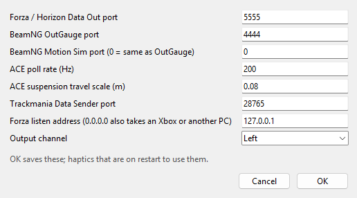

# Advanced settings, the settings file and the command line

[OpenShaker guide](README.md) › Using OpenShaker

The Advanced dialog, the settings kept only in the settings file, where settings and logs live, and the command-line options.

## The Advanced dialog

**Advanced...** opens a small dialog of settings most people never need to change. **OK** saves them and restarts the haptics if they are on. **Cancel** discards them. If you type something that isn't a number, a "Not a number: ..." box appears and nothing is saved.

| Setting | Default | What it does |
|---|---|---|
| Forza / Horizon Data Out port | 5555 | The UDP port Forza sends to. Must match the game's Data Out port. |
| BeamNG OutGauge port | 4444 | The UDP port for BeamNG's OutGauge data. |
| BeamNG Motion Sim port (0 = same as OutGauge) | 0 | With 0, one port receives both of BeamNG's protocols. Enter another number if you set Motion Sim to a different port in BeamNG. |
| ACE poll rate (Hz) | 200 | How often Assetto Corsa EVO's data is read per second. The minimum is 20. |
| ACE suspension travel scale (m) | 0.08 | How many metres of suspension movement count as "full" travel in ACE. Changing it changes how strong the road feel is in ACE. |
| Trackmania Data Sender port | 28765 | The TCP port of the Openplanet Data Sender plugin. OpenShaker connects to it. |
| Forza listen address (0.0.0.0 also takes an Xbox or another PC) | 127.0.0.1 | 127.0.0.1 accepts Forza only from this PC. 0.0.0.0 also accepts it from an Xbox or another PC on your network. See [Playing from an Xbox or another PC](Setting-Up-Your-Games.md#playing-from-an-xbox-or-another-pc). Leaving it empty means 127.0.0.1. |
| Output channel | Left | Which channel(s) of the output carry the signal: Left, Right or Both. Any other layout set by hand in the settings file shows as "Custom" and is kept. See [Shakers, amplifiers and channels](Shakers-Amplifiers-and-Channels.md). |

A few more settings exist only in the settings file. They are listed under [Settings and logs](#the-settings-file).

## The settings file

### Where things are
- **Settings:** `%APPDATA%\OpenShaker\config.json`. The tray's **Open settings folder** takes you there.
  - Power users can move the folder with the `OPENSHAKER_HOME` environment variable.
- **Logs:** `%APPDATA%\OpenShaker\logs\`.
  - OpenShaker writes only one file there, `gui_error.log`, and only when it fails to start or can't reach a stuck copy of itself. There is no running log.
  - File paths in that log can contain your Windows user name, so check it before sharing it.
- The presets' calibration files are part of the installed program and are never changed.

### What is saved
`config.json` holds only what you own:
- your per-game presets (strengths and on/off switches you changed);
- settings you changed from the defaults (device, Master, channel, ports and so on);
- the last profile;
- the Haptics on switch, but only while it is **off**.

Calibration levels are never written into it, so updates can improve the presets without your file getting in the way. Keys you add by hand are kept when the app saves.

### Settings that are only in the file
These are not in the window or the Advanced dialog. Quit OpenShaker before editing the file by hand.

| Key | Default | What it does |
|---|---|---|
| `audio.api` | WASAPI | Preferred Windows audio system |
| `audio.samplerate` | 48000 | Sample rate. If the device refuses it, OpenShaker tries the device's own rate, then 48000, then 44100. |
| `audio.blocksize` | 480 | Audio block size (10 ms at 48 kHz) |
| `sources.<game>.enabled` | true | Set to false to stop listening for one game and free its port for good |
| `sources.beamng.host` | 127.0.0.1 | The address OpenShaker listens on for BeamNG |
| `sources.trackmania.host` | 127.0.0.1 | The address of the Data Sender plugin that OpenShaker connects to |
| `sources.beamng.accel_scale` | 1.0 | Scales BeamNG's g-forces. Raise it if collisions never trigger, lower it if they always do. |
| `sources.trackmania.max_rpm`, `idle_rpm` | 11000, 1000 | Rev range assumed for every Trackmania car. A per-car `cars` block in the Trackmania profile would override it; the shipped profile has none. |
| `sources.trackmania.damper_range_m` | 0.2 | Suspension travel counted as "full" in Trackmania |
| `game_processes.forza_horizon5`, `game_processes.forza_horizon6` | forzahorizon5.exe, forzahorizon6.exe | Program names used to tell Horizon 5 from 6 |

### Resetting everything
Quit OpenShaker (tray > **Quit**), delete `config.json`, then start it again.

## Command-line options

### OpenShaker.exe

The installed program is at `%LOCALAPPDATA%\Programs\OpenShaker\OpenShaker.exe`. Unknown options are ignored.

| Option | What it does |
|---|---|
| `--hidden` | Start in the tray without showing the window. Start with Windows uses this. Without a tray, the window starts minimised. |
| `--no-start` | Start with the haptics off **for this launch only**. Your saved switch isn't changed. Useful for freeing the game ports for another tool. |
| `--no-tray` | Window only, with no tray icon. Closing the window then quits. |
| `--quit` | Ask a running copy to quit and wait up to 10 s. It prints "OpenShaker is not running.", "... has quit." or "... did not quit within 10 s." (exit code 1 when it times out). |

Example: `"%LOCALAPPDATA%\Programs\OpenShaker\OpenShaker.exe" --quit`

### Running from source

These tools exist only in a copy of the source code, not in the installed program.

**Console runner: `python -m openshaker`.** A drive run can't start while the tray app is running, because they would share the game ports, so use `--quit` first. (`--gui` brings up the running window instead, and `--list-devices` and `--test-tone` run either way.)

| Option | What it does |
|---|---|
| `--gui` | Open the window (or bring up the running one) |
| `--config PATH` | Use another settings file |
| `--profile PATH` | Start with a given profile. Automatic switching still takes over when a game is detected. |
| `--list-devices` | List sound outputs as `[index] name (audio system, channels, Hz)` |
| `--device NAME` | Output device |
| `--test-tone SECONDS`, `--tone-freq HZ` | A plain sine (40 Hz by default) scaled by Master, with no limiter. This is different from the window's sweep. |
| `--demo`, `--duration S` | Play the Demo, optionally for a set time |
| `--wav PATH` | Record the output to a mono 16-bit WAV |
| `--log DIR`, `--overwrite` | Record telemetry, output and details for a drive. It refuses to overwrite an existing log unless `--overwrite` is given. |
| `--stop-file PATH` | Stop when this file appears |
| `--no-audio` | Run without sound output |
| `--source auto\|forza\|ace\|beamng\|trackmania` | Listen to one game only |
| `--forza-port`, `--beamng-port` | Override ports |
| `--gain 0..1` | Override Master |
| `-v`, `--verbose` | Show per-effect levels |
| `--version` | Print the version |

Notes:
- Help says `--device ""` means the Windows default, but an empty name is ignored. Use "(Windows default output)" in the window instead.
- With `--gui`, the `--device`, `--gain` and port overrides are saved with your settings the next time the app saves.

**Other source tools:**
- `python -m openshaker.gui --quit` quits a running copy.
- `python -m openshaker.autostart on|off|status|repair|startmenu` manages Start with Windows for a source copy.
  - `status` warns if the Python used at sign-in would open a console window;
  - `repair` fixes that;
  - `startmenu` adds a Start menu entry.
- Setting up a source copy (Python 3.10 or newer, a virtual environment and `requirements.txt`) is described under [For developers](../../README.md#for-developers) in the README; the recording and calibration tools are in [Calibration](../CALIBRATION.md).
- **Tuning tools** for your own recorded drives, explained in [Calibration](../CALIBRATION.md):
  - `python -m openshaker.beamng_check <log>` reports which BeamNG protocols arrived, how Motion Sim's axes map onto the car, and how big the bumps, hits and lock-ups were;
  - `python -m openshaker.tm_grip <log>` and `python -m openshaker.tm_tune <log>`, each with `--apply`, fit Trackmania's grip limits, rev range, bumps, crash threshold, landings and surface names.

---

**Next:** [Start with Windows, updates and uninstalling](Start-With-Windows-Updates-and-Uninstalling.md)

**See also:** [Shakers, amplifiers and channels](Shakers-Amplifiers-and-Channels.md) · [Playing from an Xbox or another PC](Setting-Up-Your-Games.md#playing-from-an-xbox-or-another-pc)
