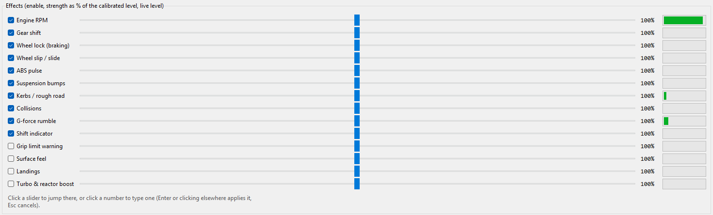

# The main window

[OpenShaker guide](README.md) › Using OpenShaker

Every control in the OpenShaker window, from top to bottom.

The window is titled **OpenShaker 1.0.0**. The sections below go through it from top to bottom.

## Haptics on

The bold **Haptics on** checkbox at the top left is the main switch.

- **Ticked:** OpenShaker opens your shaker's audio output and listens for games.
- **Unticked:** everything stops. The shaker's audio stream closes, the game listeners close, and the game ports are free for other programs. The message line says:
  > Haptics are switched off: nothing plays, and the game ports are free for other programs. Tick Haptics on (here or in the tray menu) to turn them back on.
- **The off state is remembered.** If you switch the haptics off, they stay off the next time OpenShaker starts, including when it starts with Windows. When it starts hidden in the tray, the signs are the grey tray icon, the tooltip "OpenShaker - haptics off" and the tray menu line "Haptics: off".
- This checkbox and the **Haptics on** item in the tray menu are the same switch and always match.
- If switching on fails, an error dialog appears. If the window is hidden, you get a tray notification instead.
- If OpenShaker can't save the switch (see [The settings file](Advanced-Settings.md#the-settings-file)), it warns you that the switch will go back to its old state after a restart.

## Games or Demo

The two buttons at the top right choose where the telemetry comes from:

- **Games** listens to real games. This is the normal mode.
- **Demo** plays a 24-second scripted drive so you can feel the effects without a game. See [Try the Demo](Is-It-Working.md#try-the-demo).

If the haptics are on, changing the mode restarts them. If they are off, the new mode applies the next time you switch them on. The choice is **not saved**: OpenShaker always starts in **Games**.

## Preset

The **Preset** list picks the game preset you see and edit; the note next to it says whether it is the one playing. How presets work is on [Presets and strengths](Presets-and-Strengths.md).

## Start with Windows (in the tray)

When this is ticked, OpenShaker starts hidden in the notification area when you sign in to Windows. As long as **Haptics on** is ticked, it then plays haptics whenever a supported game sends telemetry. The checkbox shows the real Windows setting: it is read when the window opens and again after every change you make. See [Start with Windows](Start-With-Windows-Updates-and-Uninstalling.md#start-with-windows) for how it works.

## Status line

The line under the checkbox shows the state of the haptics. Every message is listed on [Is it working?](Is-It-Working.md#the-status-line).

## Telemetry

This frame shows what the app is receiving.

- **Header:**
  - `no game detected`, or while running `no game detected (waiting for telemetry)`.
  - Once data arrives: the source, frames per second and, in Demo, the current scene. For example `Forza (UDP)  60 fps`.
  - `(paused)` means the game says you are not driving right now: a menu, a pause or a respawn.
- **Eight readouts:** RPM (current/max), Gear (`R`, `N` or a number), Speed (km/h), Throttle %, Brake %, and G long, G lat and G vert (in g, with a sign).
- **Sources line:** every game listener and what it is doing. For example `Forza (UDP): listening on UDP 5555`, `BeamNG (UDP): OutGauge + Motion Sim`, `Assetto Corsa EVO: waiting for Assetto Corsa EVO`, or `Trackmania (Openplanet): waiting for Openplanet Data Sender on 127.0.0.1:28765 (...)`. In Demo mode it just says `Demo: starting`, which is normal.

Data more than 1 second old counts as gone, and every effect fades out. If two games send at the same time, the newest data wins.

## Output: Level, Master and Device

**Level** shows the loudest point of what is being sent to the shaker, from -60 dB to 0 dB. `-inf dB` means silence. Near 0 dB the output limiter is working (see [Safety](Safety.md)).

**Master** is one volume control for everything.
- It runs from **0 to 100 %**. **100 % is the calibrated level** and the default.
- It snaps to whole percent. With the slider selected, the arrow keys move it 1 % and Ctrl+arrow keys move it 10 %. Click the number to type a value.
- Changes apply at once and are saved about 0.8 s after you stop, so a lowered Master is still lowered after a restart.
- Master applies to **all presets**. **Reset preset to calibrated** doesn't change it.
- Master can't go above 100 %. To get more, raise individual effect strengths (up to 200 %) or turn up the amplifier.

**Device** chooses the sound output your shaker is connected to.
- The list is read again each time you open it:
  - `(Windows default output)` comes first;
  - then every output Windows offers in shared mode (WASAPI first, then DirectSound, then MME), without duplicates;
  - a saved device that is unplugged right now stays in the list.
- **On a new install the device is "ButtKicker".** Any output with "ButtKicker" in its name is found automatically. With another shaker you'll see "output device 'ButtKicker' is not connected - pick your shaker under Output > Device" until you pick it.
- **A named device never falls back** to a different output. If your shaker is missing, nothing plays, rather than your speakers shaking. Only `(Windows default output)` follows Windows. That can mean your speakers after the shaker is unplugged.
- When you pick a device, OpenShaker saves it and restarts the haptics if they are on. If they are running after that, the message line says "Output: *&lt;device&gt;*. Start with the amplifier turned down and use Test tone."

## Effects

The frame "Effects (enable, strength as % of the calibrated level, live level)" has one row for each of the [14 effects](Effects-Overview.md), in the same order in every preset. Each row has:

1. **A checkbox** that turns the effect on or off for this preset.
2. **A strength slider from 0 to 200 %.** 100 % is the calibrated level that ships with the preset. Clicking anywhere on the track jumps there and follows the mouse. You can also drag the knob.
3. **A number box.** Click it to type a strength. `85`, `85%` and `85,5` all work, and the value is rounded to a whole percent. Press Enter or click elsewhere to apply, or press Esc to cancel. Values outside 0-200 are limited, with a message. Opening the box without typing changes nothing.
4. **A live bar** showing how active the effect is right now.

Good to know:
- **Edits belong to the preset on screen** and save themselves. You feel them at once only if that preset is
  the one playing. See [Presets and strengths](Presets-and-Strengths.md#saving).
- **The live bar shows activity, not loudness.**
  - For continuous effects (such as the engine, wheel lock, wheel slip, kerbs, G-force rumble and the shift indicator) the bar shows the level before your strength is applied. It moves even at 0 % strength, and even for an effect the preset has silenced. A full bar can still be quiet: in Forza Motorsport the engine bar sits almost full while the engine plays softly.
  - For one-shot effects (gear shift, collisions, bump thumps, landings) the bar includes the strength, so at 0 % it stays empty.
  - The Suspension bumps bar shows bumps and fine texture, not the continuous road bed. In the Forza games and Assetto Corsa EVO it stays nearly empty while the road bed plays.
  - An unticked effect's bar freezes at its last value.
- **Some effects can't be raised with the slider** in some games, because the preset ships them at zero (0 × any strength is still 0). See [Why some effects are silent](Effects-Overview.md#why-some-effects-are-silent).

Under the rows a hint reads: "Click a slider to jump there, or click a number to type one (Enter or clicking elsewhere applies it, Esc cancels)."

## Buttons along the bottom

**Test tone** plays a 5-second sweep from 25 Hz up to 70 Hz. It is about as strong as the hardest hits in a game, so it is the right sound for setting your amplifier.
- If the haptics are running, the sweep is mixed into the running output ("Test tone: 25-70 Hz sweep, 5 s, through the running output.").
- If they aren't running, OpenShaker briefly opens the output itself and reports "Test tone done (*device*, N dropouts)." or "Test tone failed: ...".
- It **ignores Master** and the Demo volume cap. When it is mixed into running haptics, it passes through the same output limiter as the game effects.
- It follows the **Output channel** setting, so it is also how you check Left, Right or Both.

**Restart haptics** stops everything and starts again. Use it after plugging the shaker back in, or to retry a failed start straight away. If the haptics are off, it switches them back on.

**Advanced...** opens [Advanced settings](Advanced-Settings.md).

**Reset preset to calibrated** puts the preset on screen back to its shipped levels and switches; see
[Going back to the calibrated levels](Presets-and-Strengths.md#going-back-to-the-calibrated-levels).

The **Open settings folder** item is only in the tray menu, not in the window.

## Message line

The grey line at the bottom explains what just happened. Its default text is "Strengths save themselves. A preset becomes active when its game is detected." Other messages include:

- "Running. Drive in the game; strengths can be changed live."
- "Could not start haptics: ... - retrying."
- "*&lt;device&gt;* stopped playing - unplugged or switched off? Retrying; Restart haptics tries again now."
- "Could not save settings: ..."
- "(no tray icon: ...)" when the tray packages are missing, which only a copy run from source can lack.

## Closing the window

The **X** button **hides the window to the tray**, and the haptics keep running. The first time, a notification says "Still running here. Right-click for status, left-click to open." That notification can be skipped if another one was already shown in the same session. To exit completely, use **Quit** in the tray menu.

If there is no tray icon (the `--no-tray` option, or running from source without the tray packages), **X** quits the app.

## Runs only once

Starting OpenShaker again just brings the running copy's window to the front. It uses a private local connection (port 49731 on this PC only), which is not reachable from the network and causes no firewall prompt.

---

**Next:** [The tray menu](The-Tray-Menu.md)

**See also:** [Presets and strengths](Presets-and-Strengths.md) · [Advanced settings](Advanced-Settings.md)
