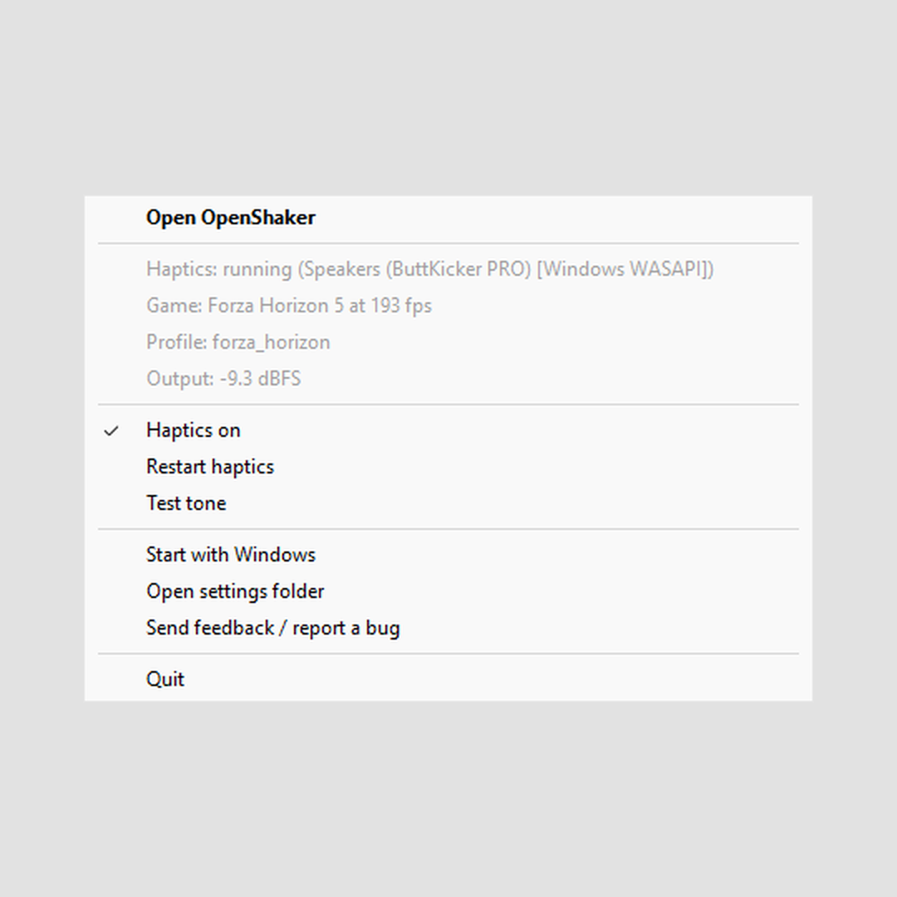

# The tray menu

[OpenShaker guide](README.md) › Using OpenShaker

The tray icon's right-click menu, item by item, and the notifications OpenShaker shows while its window is hidden.

## Icon and tooltip

The icon is in colour while the haptics run and grey otherwise; hovering shows the state. Details on [Is it working?](Is-It-Working.md#the-tray-icon). A small red **!** means an update is available ([Updating](Start-With-Windows-Updates-and-Uninstalling.md#updating)). **Left-click** opens the window.

## Menu items

Right-click the icon for the menu. When a newer version is available, two items come first: **Update to X.Y.Z** (downloads, checks and installs it, then OpenShaker comes back in the tray) and **What's new** (the release page in your browser); see [Updating](Start-With-Windows-Updates-and-Uninstalling.md#updating). Then:

1. **Open OpenShaker** shows the window and brings it to the front.
2. **Status lines** (grey, for reading only; refreshed about once a second):
   - `Haptics: running (<device> [<audio system>])`, or `Haptics: running (<device> [<audio system>], N dropouts)` if the audio has stuttered. Other states: `Haptics: starting...`, `Haptics: NOT running`, `Haptics: off` or `Haptics: off (--no-start)`.
   - `Game: -`, `Game: none detected (waiting for telemetry)` or `Game: <game> at <fps> fps`, plus ` (paused)` when the game is paused or in a menu.
   - `Profile: <profile name>`, for example `Profile: forza_horizon` (Horizon 5 and 6 both use it), or `Profile: defaults`.
   - `Output: silent` or `Output: <level> dBFS`.
   - `Problem: ...` appears only when something is wrong. For example, when another program holds a game port you'll see "cannot bind UDP 5555 ... is HaptiConnect or another tool using it?"
3. **Haptics on** is the same switch as in the window. A tick means on.
4. **Restart haptics** does the same as the window button.
5. **Test tone** does the same as the window button.
6. **Start with Windows** is ticked when OpenShaker starts at sign-in. Click it to change that.
7. **Open settings folder** opens `%APPDATA%\OpenShaker` in File Explorer.
8. **Send feedback / report a bug** opens the project's GitHub "new issue" page in your browser. You can choose "Bug report", "Idea / feature request" or "Hardware / feel report", and there is a Discussions link for questions. Nothing is attached or sent automatically. If no browser opens, the address appears in the window's message line: https://github.com/baddo-baddo/OpenShaker/issues/new/choose
9. **Quit** saves your settings, stops the haptics, removes the icon and exits.

## Pop-up notifications

While the window is hidden, OpenShaker uses tray notifications to tell you about:
- the output device not being found (once per session);
- the shaker stopping: "*&lt;device&gt;* stopped playing. OpenShaker picks it up again when it is back.";
- an error when switching the haptics on or restarting them fails (the automatic retries stay quiet);
- the Haptics on switch not being saved;
- the first time you close the window (see [Closing the window](The-Main-Window.md#closing-the-window)).

An available update never shows a notification: only the badge, the two menu items and the window's bar.

---

**Next:** [Presets and strengths](Presets-and-Strengths.md)

**See also:** [The main window](The-Main-Window.md) · [Is it working?](Is-It-Working.md)
